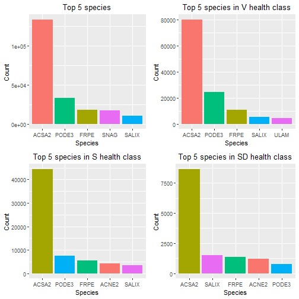

Floodplain Forest Group: Progress Report, Week 2
========================================================
author: Sal Balkus, Noah Dean, Makayla McDevitt 
date: 6/12/20
autosize: true
css: Week2-Presentation.css
type: section

Context
========================================================

Floodplain forests are essential for...
- Survival and movements of plant and wildlife
- Wetland and aquatic ecosystems 
- Economy & recreation 

Issues:
- Loss of species diversity 
- Climate change 
- Management: composition-based classification systems that disregards size structure

Overview & Goals
========================================================

Datasets: forest composition, land use change, and hydrology

1) Characterize the diversity of UMRS floodplain forests in terms of composition & structure

Primary Topics: 
- Species diversity
- Forest succession

2) Determine what influences the patterns found in this characterization

Overarching Goal: Inform forest management decisions 

Literature Review
========================================================

Common topics and themes: 
- Overview of previous research 
- Composition and structure: 
  - Vegetation
  - Species diversity and invasive species
  - Forest succession 
  - Plant community distributions
  - Size structure

Literature Review cont'd.
========================================================

- Relevance to future studies 
- Implications for restoration & overall management 
- Connections to climate change 

Data Cleaning
========================================================

- Several steps to cleaning the data

- General process:

  - Exclude sites not on the UMRS floodplain proper

  - Change species codes to match USACE system
  
  - Retain the relevent columns
  
  - Translate health codes to `D`, `V`. `S`, and `SD`
  
  - Remove unknown species
  
  - Remove entries with DBH of 0
  

Initial Questions: Unique species and abundance
========================================================

- 66 distinct species were recorded

- The top five species by stem count were silver maple, cottonwood, green ash, snag, and willow spp.

- The top five species by basal area were silver maple, cottonwood, snag, green ash, and willow spp.

Initial Questions: Unique species and abundance
========================================================

Initial Questions: Unique species and abundance
========================================================

Initial Questions: Rare species
========================================================

- The 5 rarest species are ohio buckeye, possumhaw, sweetgum, black cherry, and pin oak

|Species      |Plot ID       |TR_HLTH | Basal Area|
|:------------|:-------------|:-------|----------:|
|ohio buckeye |GILBERT-2-139 |V       |      19.63|
|possumhaw    |UDRIFT-2-108  |V       |     660.52|
|sweetgum     |LINCOLN-1-92  |V       |     346.36|
|black cherry |p03711        |V       |     153.94|
|pin oak      |p02281        |V       |      28.27|

Initial Questions: Pure plots
========================================================

- Nearly 40% of the plots have very low diversity

| Species present| Count| Percentage|
|---------------:|-----:|----------:|
|               1|  2494|       13.2|
|               2|  4483|       23.6|
|               3|  5263|       27.8|
|               4|  3862|       20.4|
|               5|  1912|       10.1|
|               6|   688|        3.6|
|               7|   192|        1.0|
|               8|    44|        0.2|
|               9|    15|        0.1|
|              10|     2|        0.0|
|              11|     2|        0.0|

Initial Questions: Species uniqueness
========================================================

- 17 species are unique to a pool

- 27 species are unique to a district

- The pools with unique species are p05, p08, p24, p25, p26, pOR, and p18

- StPaul, StLouis, RockIsland is the only district with unique species

Initial Questions: Snag distribution
========================================================

Initial Questions: Snag distribution
========================================================

Preparation for Analyzing by Plot
========================================================
- Function to filter out species that only appear in fewer than n plots
- Pivot table listing frequency, trees per acre, and relative trees per acre for each plot
  - dataset of plots, rather than trees; important for later
- Exploration of distributions for top 5 species:
  - Frequency and TPA very right-skewed with few high outliers; requires log-transform
  - Relative TPA [0-1] skewed either 0 or 1 (mostly 0)
  

ACSA2 Trees-per-acre distributions
========================================================

  
Main Questions Raised
========================================================

To explore:
- Which species appear together, and in what quantities?
- How does basal area and health vary among species within plots?
- What transformations should be used to deal with outliers?

To ask:
- How ecologically important are unique species?
- In how many plots should a species be present to be considered in our further analysis?

What are our next steps?
========================================================

Our goal now is to develop a way to classify plots based on forest type.

Level 1: define plots based on dominant species
- simple rules-based formula
- dominance based on basal area and density

Level 2: define using multivariate analyses of level 1 classes
- multivariate analysis
- clustering

What are our next steps?
========================================================

Tasks:
- Use R to determine dominant species for each plot, or if plot is codominant/mixed
- For mixed plots, research ordination methods to use for mixed plot classification
- Research clustering methods to use for level 2 classification

References
========================================================

Cover Image: Forest Landscape Ecology of the Upper Mississippi River Floodplain, United States Geological Survey

Floodplain Forest Classification Overview (Van Appledorn)
