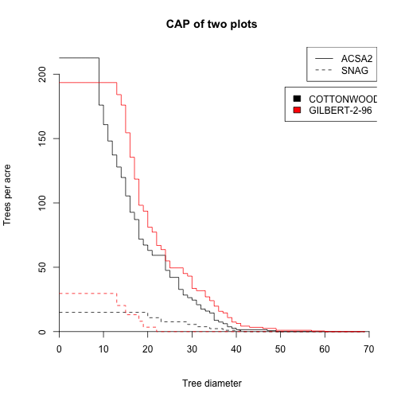
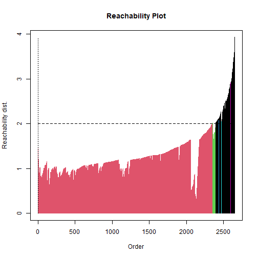
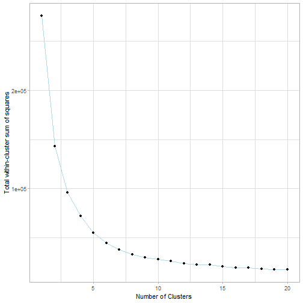
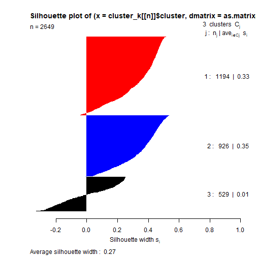
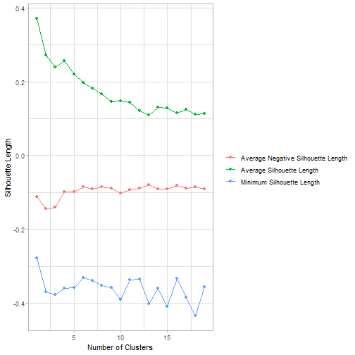
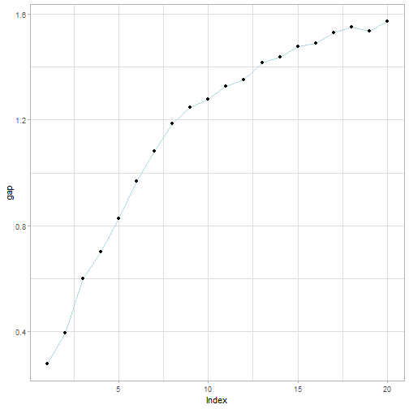
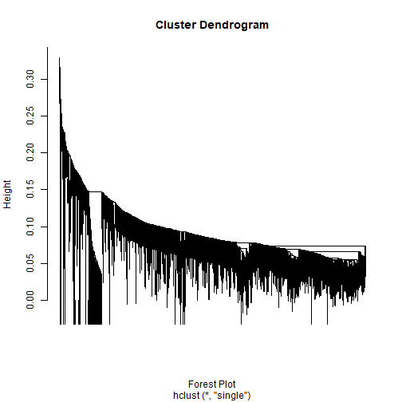
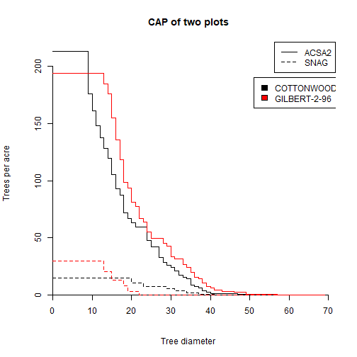

Floodplain Forest Group: Progress Report, Week 3
========================================================
author: Sal Balkus, Noah Dean, Makayla McDevitt 
date: 6/19/20
autosize: true
css: Week3-Presentation.css
type: section


Level 1 Classification
========================================================


CAP
========================================================


Level 2 Classification
========================================================

Our next goal is to subdivide the Level 1 categories using clustering.

The number of clusters should be numerous enough to capture different forest types within the Level 1 categories, but not so numerous that similar forest types are repeated across multiple clusters.


Strategy
========================================================
Because the Level 1 categories are so numerous, a systematic approach must be developed to generate subcategories.

First, we perform experimentation using the ACSA2-dominant (silver maple) plots. Through this, we develop a function to select the appropriate number of clusters. Since "silver maple dominant" is the most numerous and complex (besides mixed), our approach developed here will not be too simplistic for any other group.

Once our function is developed, we will apply it across all level 1 classifications. Mixed plots will be clustered separately, since they are the largest level 1 category, much larger than others.


Potential Clustering Methods
========================================================
Level 2 categories are determined via clustering, which groups plots based on their dissimilarity (Bray-Curtis, based on CAP values).

We considered several potential clustering algorithms:
- K-means
- Hierarchical (single linkage, complete linkage, Ward's method)
- DBSCAN/OPTICS
- Spectral Clustering

These clustering algorithms were each tested on our data to determine their effectiveness


Spectral Clustering
========================================================
A graph-based clustering algorithm especially good for high-dimensional data
- Uses graph Laplacian eigenvalues to partition the data points
- Performs dimension reduction
- Good at picking out unique shapes
-O(n^3)

We discussed using this algorithm to cluster the data without using CAP. However, our data was too large for the slow algorithm, and the CAP values solved the high-dimensionality problem.

http://people.csail.mit.edu/dsontag/courses/ml14/notes/Luxburg07_tutorial_spectral_clustering.pdf


DBSCAN & OPTICS
========================================================
Algorithms that group observations based on density
- DBSCAN: specify minimum distance and minimum observations in each cluster
- OPTICS: specify minimum observations per cluster; creates a dendrogram that can be cut
- Can mark points as outliers if they do not fit a cluster
- No need to specify number of clusters!

https://medium.com/@xzz201920/optics-d80b41fd042a#:~:text=Reachability%2Dplot%20to%20Clustering&text=It%20is%20a%202D%20plot,valleys%20in%20the%20reachability%20plot.


OPTICS: Reachability plot
========================================================

The deeper the valley, the denser the cluster.



```
Number of clusters from DBSCAN: 6
```

***



```
Number of clusters from DBSCAN: 36
```

K-means
========================================================
Clustering method that performs partitioning by optimizing centroid placement
- assumes clusters to be spherical
- assumes equal variance within clusters


K-means
========================================================



K-means
========================================================



***



K-means
========================================================


```
Recommended clusters: 18
```

Hierarchical Clustering
========================================================
Joins points based on closeness to create a dendrogram
- Single-linkage agglomerative: joins clusters based on closest point
  - Good at differentiating complex shapes with clear boundaries
  - Without clear boundaries, often creates #Hierarchical Clustering
- Complete-linkage agglomerative: joins clusters based on farthest point
- Ward's method: joins clusters based on minimizing within-cluster variance

Single Linkage
========================================================
Unsuitable, yields an output similar to OPTICS

The single linkage picks out too many outliers, preventing the clusters from being split into actual groups

***



Complete Linkage
========================================================

Still problematic - no clear cut point

Clusters are too close together, indicating that there is no real difference between the clusters

***



Ward's Method (ward.D)
========================================================

Best approach thus far; clusters are appropriately distanced, and split into roughly even-sized groups.

Still need to investigate where to cut the dendrogram, and how to validate this clustering solution.

***


Next Steps
========================================================


Endnotes
========================================================

Cover Image: Forest Landscape Ecology of the Upper Mississippi River Floodplain, United States Geological Survey
