Floodplain Forest Group: Progress Report, Week 3
========================================================
author: Sal Balkus, Noah Dean, Makayla McDevitt 
date: 6/19/20
autosize: true
css: Week3-Presentation.css
type: section


<<<<<<< HEAD
Classification Overview 
========================================================

Goal: Classify UMRS floodplain forests in terms of composition and structure 

Two levels of classification: 

1. Tree species dominance

  -Density 
  
  -Basal area 
  
2. Clustering 


========================================================
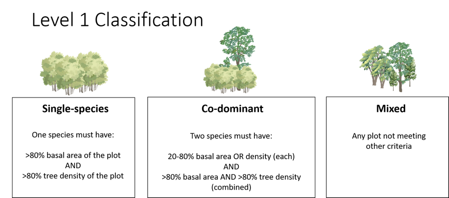


========================================================
class: small-code
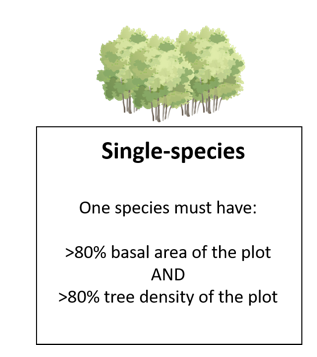

***


```r
dominant <- plots %>%
  filter(relTPA > 0.8 & relBA > 0.8)
```


```r
length(unique(dominant$Type))
```

```
[1] 36
```

```r
nrow(dominant)
```

```
[1] 4084
```


========================================================
class: small-code


*** 


```r
codominant <- plots %>%
  filter(relTPA<=0.8 | relBA<=0.8) %>%
  filter(relTPA>=0.2 | relBA>=0.2) %>%
  group_by(PID) %>%
  filter(relTPA + max(relTPA)>0.8 & relBA + max(relBA)>0.8) %>%
  filter(n() > 1) %>%
  filter(sum(relTPA)>0.8 & sum(relBA)>0.8)
```


```r
length(unique(codominant$Type))
```

```
[1] 190
```

```r
nrow(codominant)
```

```
[1] 6648
```


========================================================
class: small-code
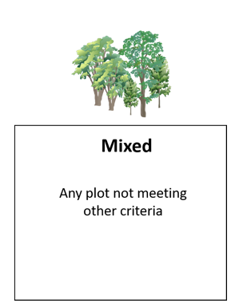

*** 


```r
mixed <- df %>%
  filter(!PID %in% dominant$PID) %>%
  filter(!PID %in% codominant$PID) %>%
  select(PID) %>%
  mutate(Type = NA, Label = "Mixed") %>%
  distinct()

nrow(mixed)
```

```
[1] 8225
```
=======
Level 1 Classification
========================================================


CAP
========================================================
>>>>>>> Sal


Level 2 Classification
========================================================

Our next goal is to subdivide the Level 1 categories using clustering.

The number of clusters should be numerous enough to capture different forest types within the Level 1 categories, but not so numerous that similar forest types are repeated across multiple clusters.

<<<<<<< HEAD
CAP will measure dissimilarity between plots.


What is CAP?
========================================================
- Cumulative abundance profile

  - Total amount of trees in or above a size class

- Uses the distribution of sizes within a species

- Allows for exploration of variation with same-species plots

CAP Example
=====
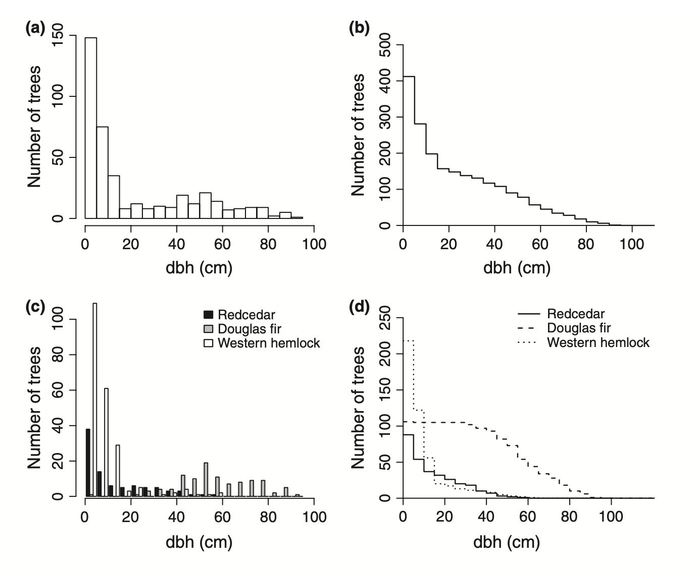

***

(DeCaceres et al, 2013)

Why care about the size distribution?
======
- The size distribution will affect how the forest behaves

- External processes may have different impacts

- Time to restore

- Allows for more efficient use of management resources

Size distribution example
====
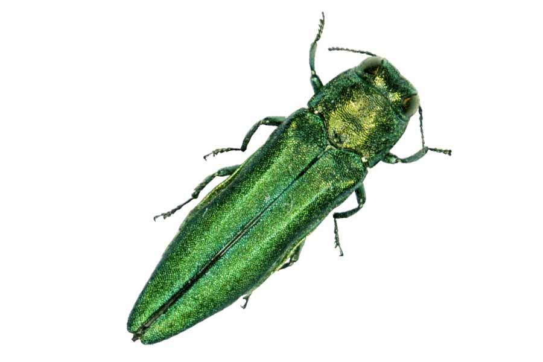

Emerald ash borer (Arbor day foundation)

***
<div align="center">
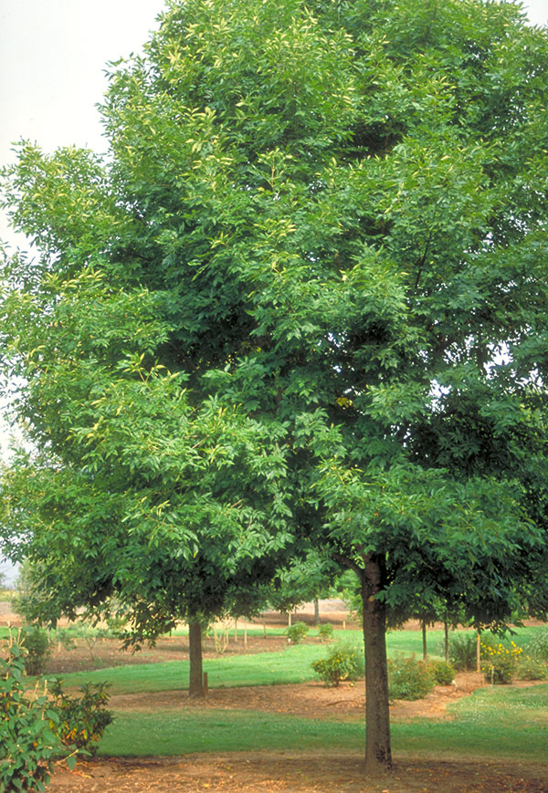
</div>
<div align="center">
Ash tree (Arbor day foundation)
</div>


How are plots compared?
=====
- Uses 3 metrics

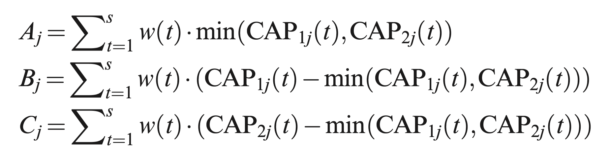

***

- Bray-Curtis dissimilarity coefficient:

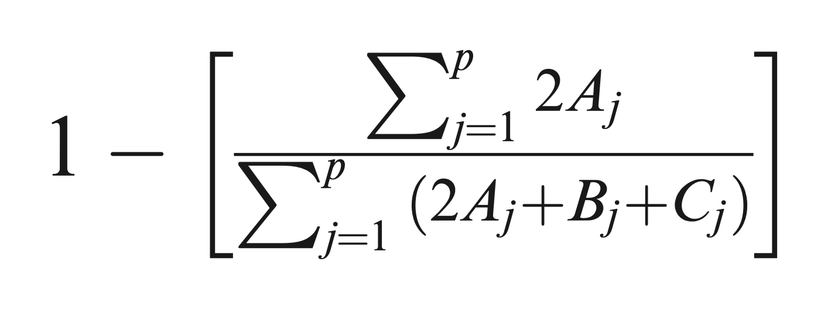

(DeCaceres et al, 2013)


Example of metrics
====
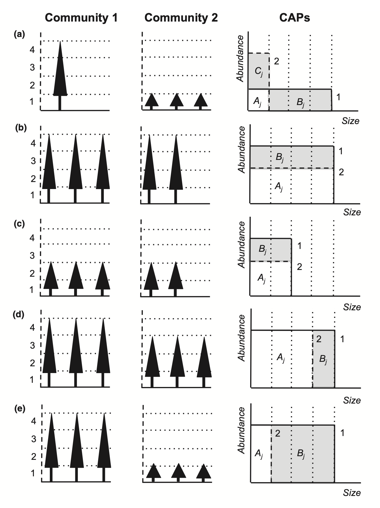

***
 
 
 
 
 

(DeCaceres et al, 2013)


Our plots
====

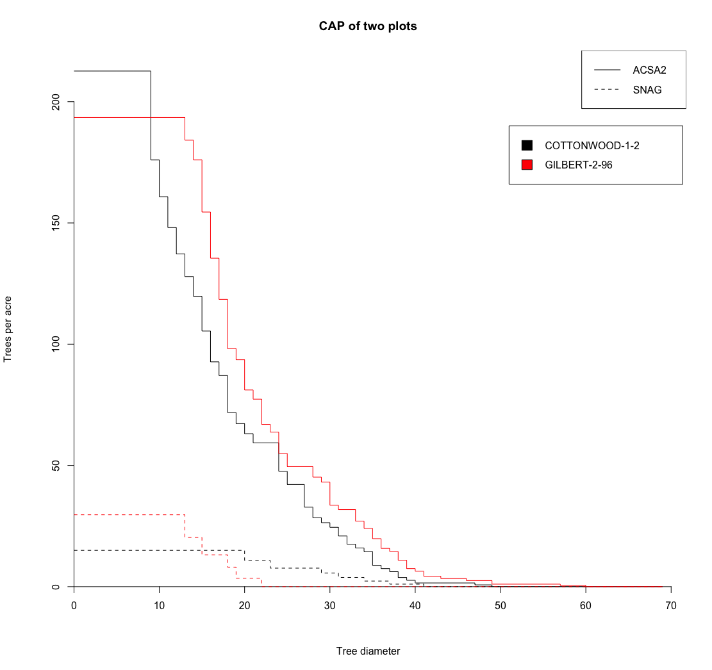

***
- The distance between them is 0.1318
=======
>>>>>>> Sal


Strategy
========================================================
<<<<<<< HEAD
Because the Level 1 categories are so numerous, use systematic approach for Level 2.

1. Perform experimentation using ACSA2-dominant (silver maple) plots
  - Develop a function to select  appropriate number of clusters

2. Apply function across all level 1 classifications
  - Mixed plots clustered separately, since category is much larger
=======
Because the Level 1 categories are so numerous, a systematic approach must be developed to generate subcategories.

First, we perform experimentation using the ACSA2-dominant (silver maple) plots. Through this, we develop a function to select the appropriate number of clusters. Since "silver maple dominant" is the most numerous and complex (besides mixed), our approach developed here will not be too simplistic for any other group.

Once our function is developed, we will apply it across all level 1 classifications. Mixed plots will be clustered separately, since they are the largest level 1 category, much larger than others.
>>>>>>> Sal


Potential Clustering Methods
========================================================
<<<<<<< HEAD
Level 2 categories determined via clustering, which groups plots based on their dissimilarity (Bray-Curtis, based on CAP values).
=======
Level 2 categories are determined via clustering, which groups plots based on their dissimilarity (Bray-Curtis, based on CAP values).
>>>>>>> Sal

We considered several potential clustering algorithms:
- K-means
- Hierarchical (single linkage, complete linkage, Ward's method)
- DBSCAN/OPTICS
- Spectral Clustering

<<<<<<< HEAD
=======
These clustering algorithms were each tested on our data to determine their effectiveness
>>>>>>> Sal


Spectral Clustering
========================================================
A graph-based clustering algorithm especially good for high-dimensional data
- Uses graph Laplacian eigenvalues to partition the data points
- Performs dimension reduction
- Good at picking out unique shapes
<<<<<<< HEAD
- O(n^3 )

We discussed using this algorithm to cluster the data without using CAP. However, algorithm was too slow, and the CAP values solved the high-dimensionality problem.

<!-- http://people.csail.mit.edu/dsontag/courses/ml14/notes/Luxburg07_tutorial_spectral_clustering.pdf -->
=======
-O(n^3)

We discussed using this algorithm to cluster the data without using CAP. However, our data was too large for the slow algorithm, and the CAP values solved the high-dimensionality problem.

http://people.csail.mit.edu/dsontag/courses/ml14/notes/Luxburg07_tutorial_spectral_clustering.pdf
>>>>>>> Sal


DBSCAN & OPTICS
========================================================
Algorithms that group observations based on density
- DBSCAN: specify minimum distance and minimum observations in each cluster
<<<<<<< HEAD
- OPTICS: specify minimum observations per cluster
- Can mark points as outliers if they do not fit a cluster
- No need to specify number of clusters!

OPTICS generates a "reachability plot" that can be cut like a dendrogram to generate clusters

<!-- https://medium.com/@xzz201920/optics-d80b41fd042a#:~:text=Reachability%2Dplot%20to%20Clustering&text=It%20is%20a%202D%20plot,valleys%20in%20the%20reachability%20plot. -->


OPTICS: Reachability plots
========================================================

Cut at distance eps = 2

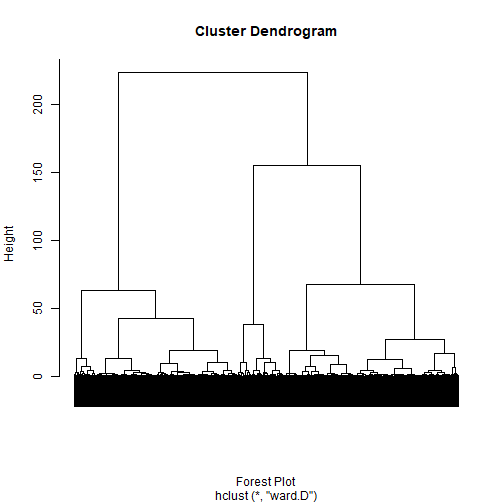

***

Cut at distance eps = 1


K-means
========================================================
Clustering method that performs partitioning by optimizing centroid placement. The algorithm is not deterministic.

Assumptions:
- spherical clusters
- equal variance of variables
- clusters have roughly equal numbers of observations

We run the algorithm from k = 1 to k = 20 and select the best clustering.


K-means: Elbow Plot
========================================================
Here, the elbow plot is relatively smooth.

Small elbows can occur depending on the random cluster initializations, but do not occur consistently. 

***


K-means: Silhouette Plot
========================================================
Example of Silhouettes by cluster for k = 3


***
Changes in silhouette statistics by cluster


K-means: Gap Statistic
========================================================

Measures goodness of a clustering measure by comparing true data clusters to  expected value of bootstrapped data clustering.

Results in a recommended k = 18, based on  criterion from Tibshirani et al (2001): 

“the smallest k such that f(k) ≥ f(k+1) - s_{k+1}”

<!-- https://web.stanford.edu/~hastie/Papers/gap.pdf -->

***


Hierarchical Clustering
========================================================
Joins points based on closeness to create a dendrogram
- Single-linkage agglomerative: joins clusters based on closest point
- Complete-linkage agglomerative: joins clusters based on farthest point
- Ward's method: joins clusters based on minimizing within-cluster variance

Single Linkage
========================================================
Unsuitable, yields an output similar to OPTICS

The single linkage picks out too many outliers, preventing the clusters from being split into actual groups

***


Complete Linkage
========================================================

Still problematic - no clear cut point

Clusters are too close together, indicating that there is no real difference between the clusters

***


Ward's Method (ward.D)
========================================================

Best approach thus far; clusters are appropriately distanced, and split into roughly even-sized groups.

Still need to investigate where to cut the dendrogram, and how to validate this clustering solution.

***


Next Steps
========================================================
- Determine which clustering is best via validation methods
  - Supervised learning with cluster labels?
- Formulate function to apply across all dominant species
- Cluster mixed forest types separately
=======
- OPTICS: specify minimum observations per cluster; creates a dendrogram that can be cut
- Can mark points as outliers if they do not fit a cluster
- No need to specify number of clusters!


DBSCAN & OPTICS
========================================================


>>>>>>> Sal


Endnotes
========================================================

Cover Image: Forest Landscape Ecology of the Upper Mississippi River Floodplain, United States Geological Survey
<<<<<<< HEAD

http://people.csail.mit.edu/dsontag/courses/ml14/notes/Luxburg07_tutorial_spectral_clustering.pdf

https://medium.com/@xzz201920/optics-d80b41fd042a#:~:text=Reachability%2Dplot%20to%20Clustering&text=It%20is%20a%202D%20plot,valleys%20in%20the%20reachability%20plot

https://web.stanford.edu/~hastie/Papers/gap.pdf
=======
>>>>>>> Sal
