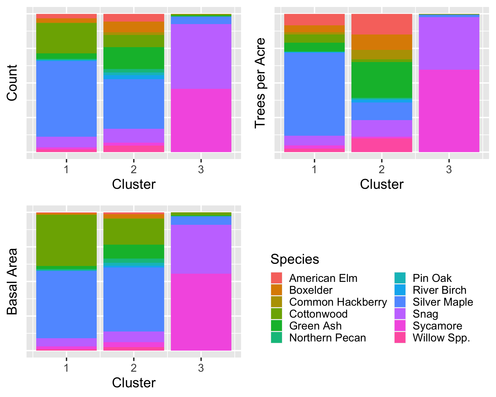

Week4-Presentation
========================================================
author: Sal Balkus, Noah Dean, Makayla McDevitt
date: 6/26/20
autosize: true
css: Week2-Presentation.css

Decision Trees
========================================================

For more details on authoring R presentations please visit <https://support.rstudio.com/hc/en-us/articles/200486468>.

- Bullet 1
- Bullet 2
- Bullet 3

Mixed Plots
========================================================

- Summary information:
 - 8225 mixed plots 
 - 43.39% of plots
 
- Plots can have significant variation in size and species distributions

- Provides a challenge in clustering plots
  - Which differences are ecologically important?

First steps
===========
left: 25%

- Use CAP values to perform a hierarchical clustering on the mixed plots

- Cut the dendrogram and look at the composition of clusters

  - Take cursory glances at species composition and the size structures within clusters

***

The Lone Plot 
====
left: 25% 

- The plot `TDB` is in a cluster by itself when k = 3

- Silver maple is prominent in both clusters 1 and 2

- `TBD` has higher amounts of snags and sycamores than the two clusters

***

  Proportion of common species in each category (count, trees per acre, and basal area)  

The Lone Plot 
====

  Proportion of species in each category (count, trees per acre, and basal area)  

Taking more clusters
======
right: 25%

  Proportion of common species in each category (count, trees per acre, and basal area)  

***
- We need to determine the correct amount clusters to make while still retaining ecological relevance

- Requires looking at the species and size distributions of the plots

- Some of the plots look similar in structure
  - 8 and 9
  - 1 and 6
  
- Need a good way to quantify the differences between clusters
  - Could potentially use CAPs of the clusters

Comparing CAPs among clusters
======

Next steps for the mixed plots
======
- Determine the best clusters for these plots

- Exact methods for this will be discussed next week
  - Possibly multidimensional scaling
  - May need to sub sample due to long run time
  
- Once clusters are picked out, we can use decision trees to find the rules for each cluster

Non-metric Multidimensional Scaling
========================================================

