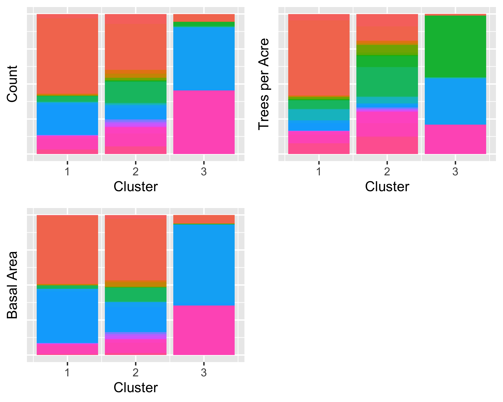
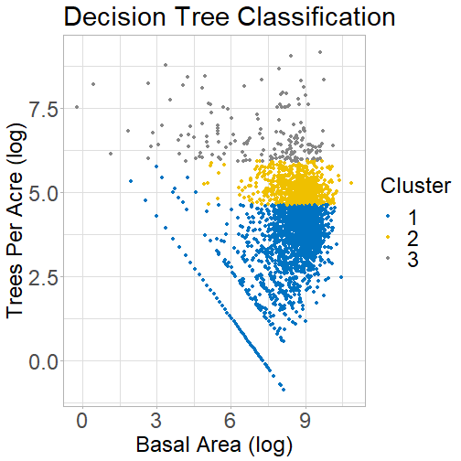
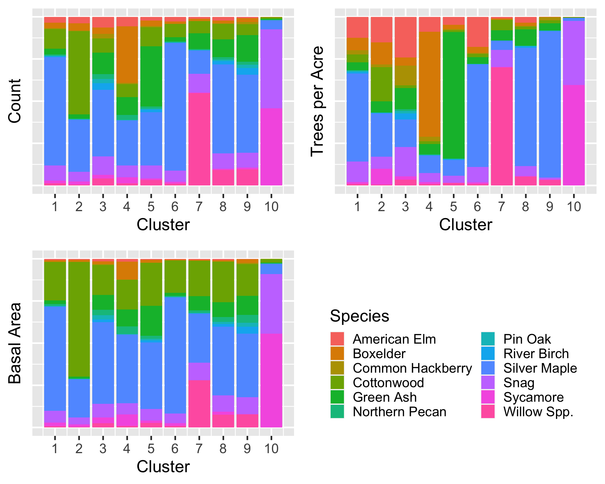
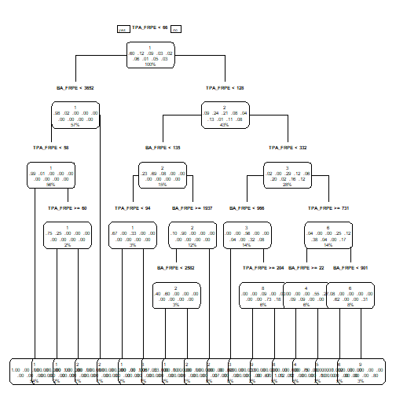
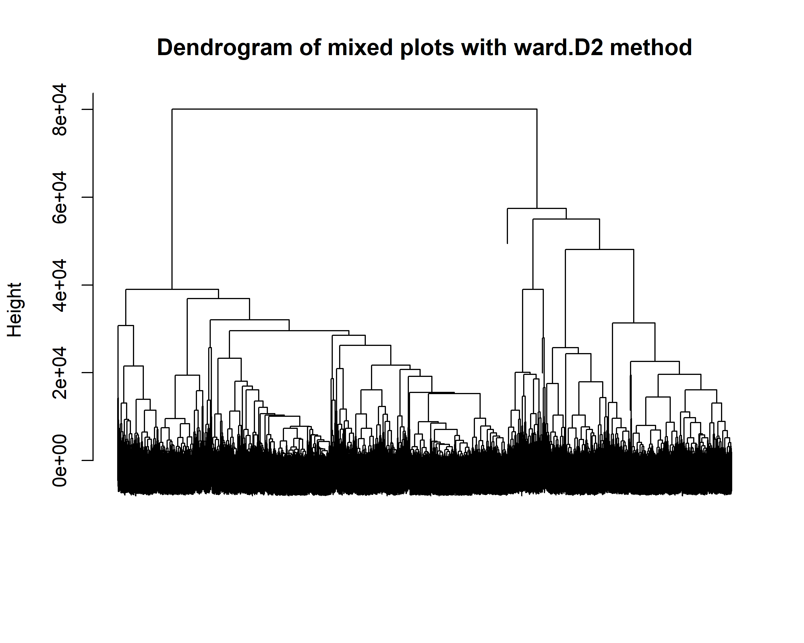

Floodplain Forest: Week 4 Progress Report
========================================================
author: Sal Balkus, Noah Dean, Makayla McDevitt
date: 6/26/20
autosize: true
css: Week2-Presentation.css
type: section


<<<<<<< HEAD
Ward's Method with Three Clusters, Silver Maple


Simplifying Clusters: Rule Extraction
========================================================
De Caceres et al (2019) recommends supervised learning for assignment rules to define clusters.

<b>Decision Trees</b> can extract rules to define clusters in a simpler manner
- Input clusters as labels for training data
- Partitions feature space based on simple logic-based rules (greater than or less than)
- Can inform on the number of clusters to use by comparing to clustering


Decision Tree versus Ward's Method
========================================================


Finding the Correct Number of Clusters
========================================================
Take the decision tree classification most similar to the Ward clustering, determined by v-measure

V-measure takes into account cluster homogeneity and completeness, which rely on entropy

<div align = "center">
</img><br>
</img>
</img>
</div>

***



Results: Green Ash
========================================================



Further Issues to Investigate in Dominant Plots
========================================================
Imbalanced Class Problem
- Some clusters may have few plots but are ecologically significant
- Potential Solution: oversample classes such that they have the same number of observations as largest class
  - Issue: can result in poor performance, as in Green Ash and Willow clusterings
  
Further Issues to Investigate in Dominant Plots
========================================================
Ecological Significance
- How can we determine if clusters are two similar?
- Potential Solution: "Multi Response Permutation Procedure" or "Permutational Multivariate Analysis of Variance"    
  - Tests for significant differences between clusters
  - How can we pick out which clusters to merge?
=======
>>>>>>> 163e80fe7520d5889b931d2c47cb5d7d4de46c18


<<<<<<< HEAD
Mixed Plots
========================================================


- Summary information:
 - 8225 mixed plots 
 - 43.39% of plots
 
- Plots can have significant variation in size and species distributions

- Provides a challenge in clustering plots
  - Which differences are ecologically important?


First steps
===========
left: 50%

- Use CAP values for hierarchical clustering on the mixed plots

- Cut dendrogram, examine cluster composition

  - Species composition and the size structures within clusters

***



The Lone Plot 
====
left: 40% 


- Plot `TDB` is lone cluster at k = 3

- Silver maple prominent in both clusters 1 and 2

- `TBD` has higher amounts of snags and sycamores than the two clusters

***
<center><b>Proportion of common species in each category (count, trees per acre, and basal area)</b></center>


The Lone Plot 
====

<center><b>Proportion of species in each category (count, trees per acre, and basal area)</b></center>


=======
>>>>>>> 163e80fe7520d5889b931d2c47cb5d7d4de46c18


<<<<<<< HEAD
V-measure: http://www1.cs.columbia.edu/~amaxwell/pubs/v_measure-emnlp07.pdf
=======
```
processing file: Week4-Presentation.Rpres
── Attaching packages ─────────────────────────────────────── tidyverse 1.3.0 ──
✓ ggplot2 3.3.1     ✓ purrr   0.3.4
✓ tibble  3.0.1     ✓ dplyr   1.0.0
✓ tidyr   1.1.0     ✓ stringr 1.4.0
✓ readr   1.3.1     ✓ forcats 0.5.0
── Conflicts ────────────────────────────────────────── tidyverse_conflicts() ──
x dplyr::filter() masks stats::filter()
x dplyr::lag()    masks stats::lag()
Loading required package: Rcpp
Parsed with column specification:
cols(
  PID = col_character(),
  POOL = col_character(),
  TR_SP = col_character(),
  TR_DIA = col_double(),
  TR_HLTH17 = col_character(),
  TR_HLTH = col_character(),
  File = col_character(),
  District = col_character(),
  TR_SP2 = col_character(),
  TreesPerAcre = col_double(),
  BasalArea = col_double()
)
Parsed with column specification:
cols(
  PID = col_character(),
  Type = col_character(),
  Label = col_character()
)
Parsed with column specification:
cols(
  .default = col_double()
)
See spec(...) for full column specifications.
Quitting from lines 10-35 (Week4-Presentation.Rpres) 
Error: 'clean_data/plots_nonrel.csv' does not exist in current working directory ('/Users/noahdean/REU_2020/UWL-REU-FPF').
Execution halted
```
>>>>>>> 163e80fe7520d5889b931d2c47cb5d7d4de46c18
