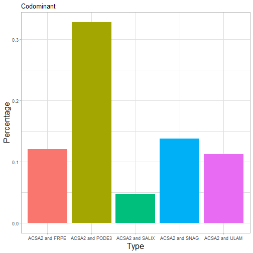

Floodplain Forest: Week 4 Progress Report
========================================================
author: Sal Balkus, Noah Dean, Makayla McDevitt
date: 6/26/20
autosize: true
css: Week2-Presentation.css
type: section


Our Current Objective
========================================================
left: 70%

To construct a hierarchical classification of UMRS forest types that are...
- Ecologically unique
- Useful to foresters
- Suitable for scientific research

<b>Last week</b>, we completed Level 1 using simple rules-based classification and examined various clustering algorithms.

<b>This week</b>, we construct a function for Level 2 classification and visualize results.

***
</img>


Summary statistics from last week: Top 5 Types
========================================================




Exploration of Ward's Clustering Method
========================================================

How can we define these clusters in a simpler manner?

How can we select the correct number of clusters to use in our definition?

How can we ensure our clusters are ecologically significant?

***


Ward's Method with Three Clusters, Silver Maple


Simplifying Clusters: Rule Extraction
========================================================
De Caceres et al (2019) recommends supervised learning for assignment rules to define clusters.

<b>Decision Trees</b> can extract rules to define clusters in a simpler manner
- Input clusters as labels for training data
- Partitions feature space based on simple logic-based rules (greater than or less than)
- Can inform on the number of clusters to use by comparing to clustering


Decision Tree versus Ward's Method
========================================================


Finding the Correct Number of Clusters
========================================================
Take the decision tree classification most similar to the Ward clustering, determined by v-measure

V-measure takes into account cluster homogeneity and completeness, which rely on entropy

<div align = "center">
</img><br>
</img>
</img>
</div>

***


Results: Green Ash
========================================================


Further Issues to Investigate
========================================================
Imbalanced Class Problem
- Some clusters may have few plots but are ecologically significant
- Potential Solution: oversample classes such that they have the same number of observations as largest class
  - Issue: can result in poor performance, as in Green Ash and Willow clusterings
  
Further Issues to Investigate
========================================================
Ecological Significance
- How can we determine if clusters are two similar?
- Potential Solution: "Multi Response Permutation Procedure" or "Permutational Multivariate Analysis of Variance"    
  - Tests for significant differences between clusters
  - How can we pick out which clusters to merge?

Minimum bin size has large impact on decision tree solution

Mixed Plots
========================================================


```
     speed           dist       
 Min.   : 4.0   Min.   :  2.00  
 1st Qu.:12.0   1st Qu.: 26.00  
 Median :15.0   Median : 36.00  
 Mean   :15.4   Mean   : 42.98  
 3rd Qu.:19.0   3rd Qu.: 56.00  
 Max.   :25.0   Max.   :120.00  
```

Non-metric Multidimensional Scaling
========================================================


References
===========

Cover Image: Forest Landscape Ecology of the Upper Mississippi River Floodplain, United States Geological Survey

V-measure: http://www1.cs.columbia.edu/~amaxwell/pubs/v_measure-emnlp07.pdf
